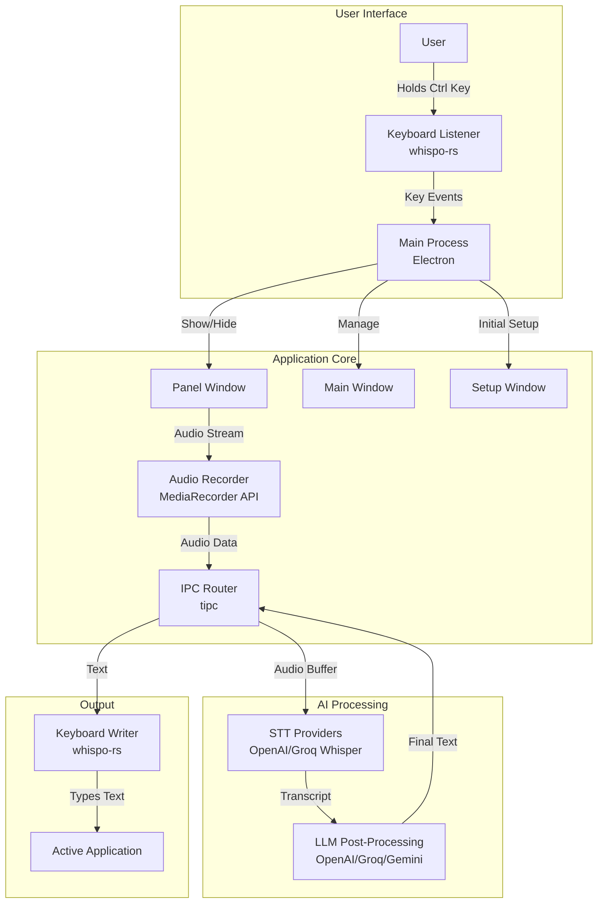
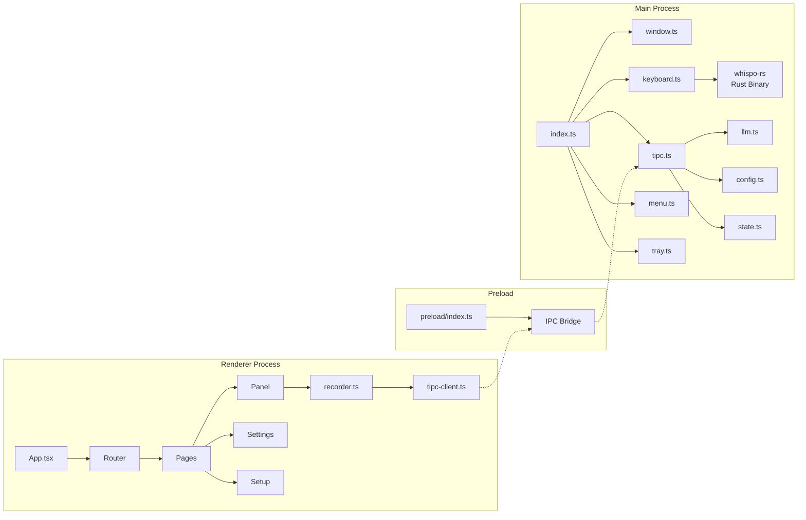
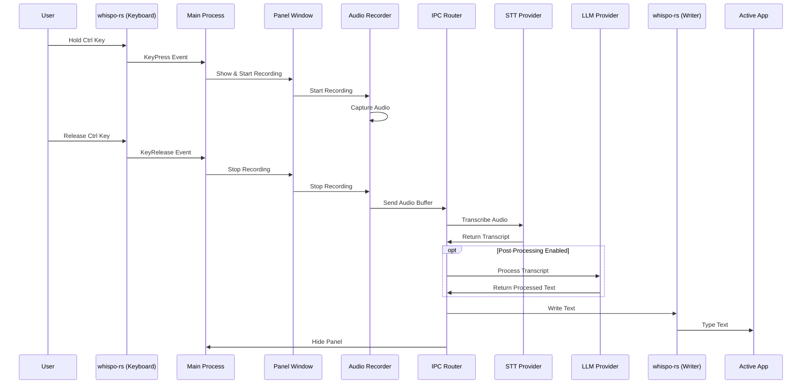

# Whispo Repository Analysis

## Overview

Whispo is an AI-powered dictation tool built with Electron, React, and Rust. It provides voice-to-text functionality with real-time transcription using various AI providers (OpenAI Whisper, Groq) and optional post-processing with LLMs (OpenAI, Groq, Gemini).

## Architecture

### High-Level Architecture



### Component Architecture



### Data Flow



## Project Structure

```
whispo/
├── src/
│   ├── main/              # Electron main process
│   │   ├── index.ts       # Entry point
│   │   ├── window.ts      # Window management
│   │   ├── keyboard.ts    # Keyboard event handling
│   │   ├── llm.ts         # LLM integrations
│   │   ├── tipc.ts        # IPC router
│   │   ├── config.ts      # Configuration store
│   │   ├── state.ts       # Application state
│   │   ├── tray.ts        # System tray
│   │   ├── menu.ts        # Application menu
│   │   └── updater.ts     # Auto-updater
│   │
│   ├── renderer/          # Electron renderer process
│   │   └── src/
│   │       ├── App.tsx    # React app entry
│   │       ├── pages/     # Application pages
│   │       ├── components/# React components
│   │       └── lib/       # Utilities & libraries
│   │
│   ├── preload/           # Preload scripts
│   │   └── index.ts       # IPC bridge
│   │
│   └── shared/            # Shared types & utilities
│       └── types.ts       # TypeScript types
│
├── whispo-rs/             # Rust keyboard listener
│   └── src/
│       └── main.rs        # Keyboard/mouse events
│
├── resources/             # Application resources
│   └── bin/              # Platform binaries
│
└── build/                # Build output
```

## Key Features

### 1. Voice Recording
- **Trigger Methods**:
  - Hold Ctrl key for 800ms to start recording
  - Release Ctrl to stop and transcribe
  - Alternative: Ctrl+/ shortcut for toggle recording
  - Escape key to cancel recording

### 2. AI Integration
- **Speech-to-Text Providers**:
  - OpenAI Whisper API
  - Groq Whisper API
  - Custom API URL support

- **LLM Post-Processing**:
  - OpenAI GPT models
  - Groq LLMs
  - Google Gemini
  - Custom prompts for text transformation

### 3. Window System
- **Main Window**: Application settings and history
- **Panel Window**: Floating recording indicator with audio visualizer
- **Setup Window**: Initial permissions and configuration

### 4. Platform Integration
- **Cross-platform**: macOS (Apple Silicon) and Windows x64
- **System Integration**:
  - Accessibility permissions for text input
  - Microphone permissions for audio recording
  - System tray integration
  - Auto-updater support

### 5. Data Management
- **Local Storage**: All data stored locally
- **Recording History**: Saved recordings with transcripts
- **Configuration**: User preferences and API keys

## Technology Stack

### Frontend
- **Framework**: React 18 with TypeScript
- **Routing**: React Router v6
- **State Management**: React Query (TanStack Query)
- **Styling**: Tailwind CSS with custom components
- **UI Components**: Radix UI primitives
- **Build Tool**: Vite

### Backend
- **Runtime**: Electron 31
- **IPC**: @egoist/tipc for type-safe IPC
- **Window Management**: @egoist/electron-panel-window
- **Configuration**: Electron Store
- **Auto-updater**: electron-updater

### Native Integration
- **Language**: Rust
- **Keyboard Events**: rdev library
- **Text Input**: enigo library
- **Build**: Cargo

### AI Services
- **OpenAI**: Whisper API, GPT models
- **Groq**: Whisper API, LLM models
- **Google**: Gemini API

## Security Considerations

1. **API Keys**: Stored locally in encrypted Electron store
2. **Permissions**: Requires explicit user consent for:
   - Microphone access
   - Accessibility permissions (for text input)
3. **Data Privacy**: All processing can be done locally or with user-chosen APIs
4. **License**: AGPL-3.0 (copyleft license)

## Development Workflow

### Scripts
- `npm run dev`: Start development server with hot reload
- `npm run build`: Build for production
- `npm run build:mac/win/linux`: Platform-specific builds
- `npm run lint`: Run ESLint
- `npm run typecheck`: TypeScript type checking
- `npm run release`: Create a new release

### Build Process
1. TypeScript compilation for Electron code
2. Vite build for React application
3. Rust compilation for keyboard listener
4. Electron Builder for packaging

## Future Considerations

Based on the codebase analysis, potential areas for enhancement:
1. Support for more STT providers
2. Custom keyboard shortcuts configuration
3. Multi-language support
4. Cloud sync for settings/history
5. Plugin system for custom processors
6. Support for more platforms (Linux ARM, etc.)